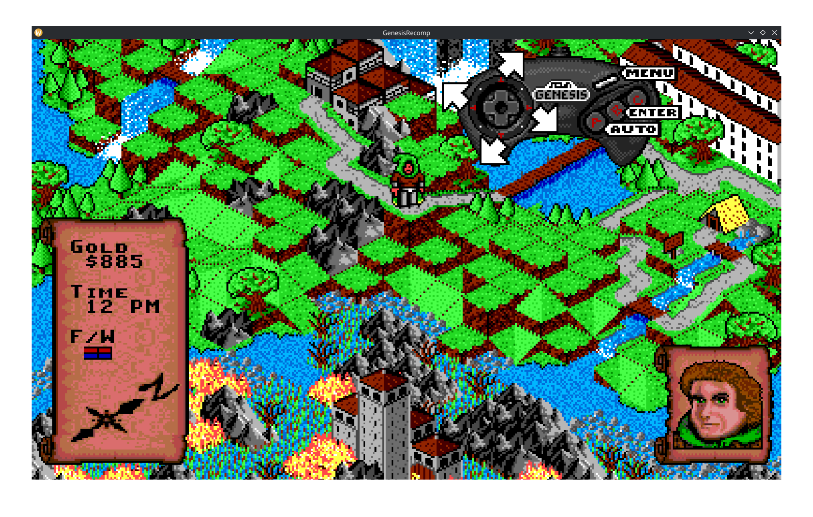
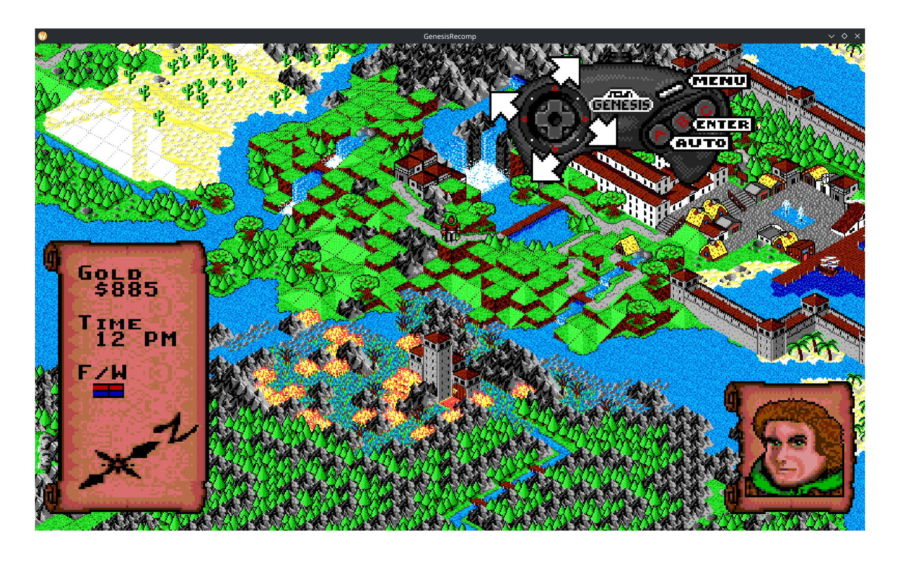
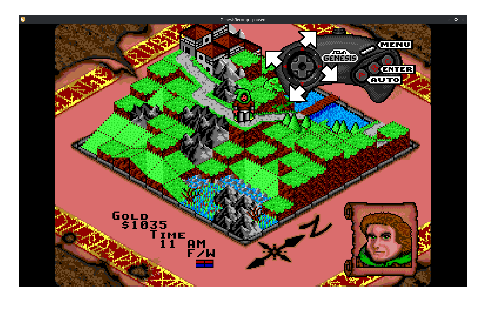
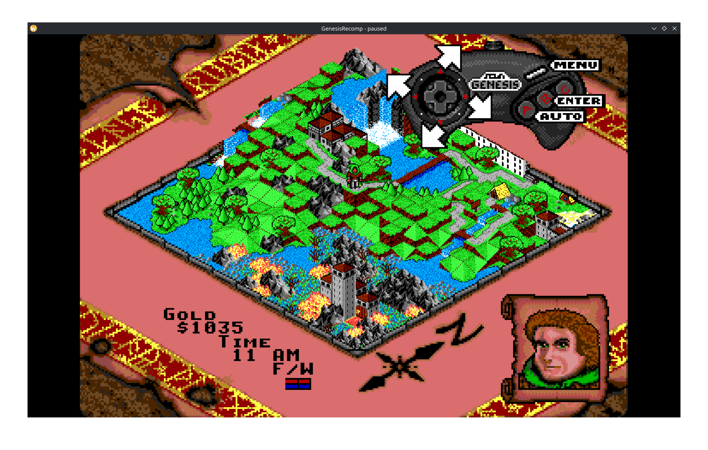
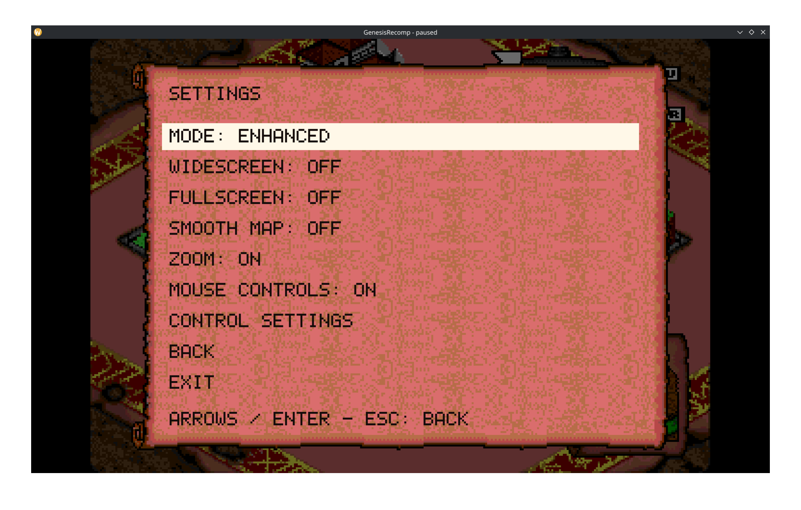

# RROP — Rings of Power Recompiled

[English](README.md) · [Сборка и запуск](docs/usage-ru.md) · [Настройки](docs/settings-ru.md)

[](https://ko-fi.com/O6R42871XC)

Если RROP полезен, можно угостить автора кофе. Спасибо за поддержку разработки!

RROP превращает **Rings of Power** для Sega Genesis / Mega Drive в нативную
программу для Linux или Windows. Код Motorola 68000 и звуковой программы Z80
статически переводится в C; исполнение поддерживает модель памяти, графики,
управления и звукового оборудования консоли.

Проект посвящён одной проверенной версии игры. Доступны:

- Вайдскрин с адаптацией мира к пропорциям окна.
- Зум 50–100% и плавная прокрутка наружной карты.
- Перерисовка текста внешним шрифтом TTF/OTF на лету.
- Управление мышью и штатный автоход игры.
- Геймпады SDL2: подключение на лету, раскладки и переназначение A/B/C/START.
- Звук YM2612/PSG, сборка для Linux и упаковка Windows x64.
- Пять ручных сохранений и пять автосохранений с интервалом пять минут активной игры.
- Настройки и выбор сохранений в оформлении оригинального свитка.
- Отчёт и аварийный снимок при внутренней ошибке Void.

Можно выбрать классический режим. Помещения и бои отображаются в стандартной
рамке при 100% масштаба, чтобы сцена не дублировалась за своими границами.

Геймпады работают в обоих режимах: [управление и настройки](docs/gamepads-ru.md).

## Скриншоты

### Вайдскрин и зум

| Приближённый вид | Уменьшенный масштаб |
| --- | --- |
|  |  |

### Оригинальный вьюпорт с зумом

| Приближённый вид | Уменьшенный масштаб |
| --- | --- |
|  |  |

### Настройки



Скриншоты сделаны во время разработки под прежним названием GenesisRecomp.

## Быстрый запуск в Linux

Ubuntu/Debian:

```sh
sudo apt install git python3 build-essential pkg-config libsdl2-dev libsdl2-ttf-dev fonts-dejavu-core
git clone https://github.com/kruzeman/RROP.git
cd RROP
mkdir -p roms
```

Положите свой `Rings of Power (UE) [!].gen` в `roms`:

```sh
python3 examples/build_rings_of_power.py 'roms/Rings of Power (UE) [!].gen' \
  --text-renderer rings-text
./build/rings-of-power/rings-of-power --window --audio on \
  --widescreen --zoom --smooth-camera --mouse \
  --font /usr/share/fonts/truetype/dejavu/DejaVuSans.ttf
```

Настройки открываются **F10**, **Esc** или **System → Settings**. Выход — через
пункт **Exit**. Стрелки задают направление, **Z/X/C** соответствуют **A/B/C**.
Подробности, Windows и другие дистрибутивы — в [инструкции](docs/usage-ru.md).

## ROM и состояние проекта

Нужен исходный ROM размером 1 MiB с SHA-256:

```text
36303fc447c433ebc69c3d4df86c783c86b383e0acead1c19595f13269e248f5
```

**В репозитории находятся исходники инструмента, сама игра не включена.**
ROM предоставляет пользователь. Сгенерированный C, executable и Windows ZIP
содержат данные игры, поэтому в исходную репу не включаются. Лицензия RROP
не распространяется на оригинальную игру, её графику, музыку или внешние шрифты.

Совместимость пока экспериментальная: полное прохождение не проверено,
некоторые переходы могут остановиться на непереведённом коде. Причина
оригинального сбоя после долгой игры ещё не исправлена; добавлена диагностика.
Наши сохранения содержат всю RAM и не повторяют очистку временных таблиц
штатной загрузкой из EEPROM.

Основная документация — на английском. Дополнительные материалы на русском:
[инструкция](docs/usage-ru.md), [настройки](docs/settings-ru.md),
[диагностика](docs/diagnostics-ru.md), [участие в разработке](CONTRIBUTING.ru.md).

Проект выделен из разработки Rings of Power в GenesisRecomp; внутреннее имя
Python-пакета `genesis_recompiler` сохранено. Собственный код — под
[MIT](LICENSE), ymfm сохраняет BSD-3-Clause; см. [лицензии зависимостей](THIRD_PARTY_NOTICES.md).
